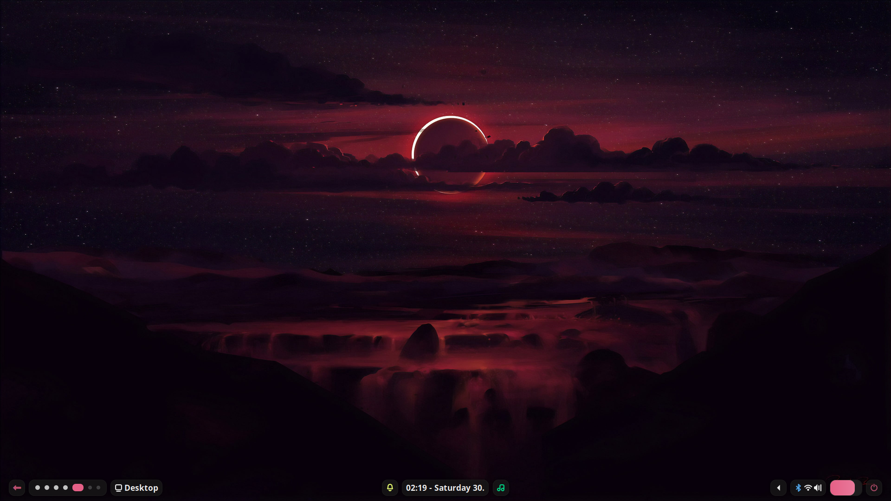

# starlight

> [!warning]
> Currently in unstable phase. Do not use in production.

[](https://github.com/ublue-os/startingpoint/actions/workflows/build.yml)

You lay in a clear field, feeling the midnight breeze as you stare into the starlight.

"starlight" is a custom operating system based on Universal Blue's `startingpoint`. "starlight" is simply a biased preconfigured system meant to be presentable and usable. More coming soon.

Special thanks to [Aylur's GTK shell](https://github.com/Aylur/ags) and [Aylur's dotfiles](https://github.com/Aylur/dotfiles).

For more info about Universal Blue, check out <https://universal-blue.org/> and their main repository at <https://github.com/ublue-os/main/>.

## Andromeda Release



This first release includes a working setup.

Roadmap at https://github.com/users/akippnn/projects/3/

## Getting started

> [!warning]
> Ventoy users, there is a known issue with Ventoy [ublue-os/main#108](https://github.com/ublue-os/main/issues/108). In the meantime, please use an alternative method to create bootable drives.


If you do not currently use Fedora OSTree system, create a bootable drive using the ISO from the [releases page](https://github.com/akippnn/starlight/releases) and then boot to it.

Otherwise, see below.

## Existing OSTree installation

To rebase an existing installation to the latest build:

- First rebase to the unsigned image, to get the proper signing keys and policies installed:
  ```
  sudo rpm-ostree rebase ostree-unverified-registry:ghcr.io/akippnn/starlight:latest
  systemctl reboot
  ```

- Then rebase to the signed image, like so:
  ```
  rpm-ostree rebase ostree-image-signed:docker://ghcr.io/akippnn/starlight:latest
  systemctl reboot
  ```

Available tags:
- `latest`
- `39`
- This repository builds date tags as well, so if you want to rebase to a particular day's build:
  ```
  rpm-ostree rebase ostree-image-signed:docker://ghcr.io/ublue-os/startingpoint:20230403
  ```

## Troubleshooting

- **Using Fish shell**  
  starlight comes with the fish shell, but the default is bash. To change this, use `just chsh /bin/fish`. To return, 
- **Codecs and containers**
  Use `rpm-ostree install [list of packages separated by spaces]`. For x264 and x265/HEVC, use `x264` and `x265` respectively. For AV1 encoder and decoder, use `rav1e` and `dav1d` respectively. Use `rpm-ostree search` to find the codecs/containers you need, or use [archwiki](https://wiki.archlinux.org/title/Codecs_and_containers).
- **Hyprland configuration**  
  For full control over the Hyprland setup, use the Hyprland session during login.
- **Unneeded packages/apps**  
  Use `rpm-ostree override remove [PACKAGE ...]`. For more info about overrides, see `rpm-ostree override`.
  
